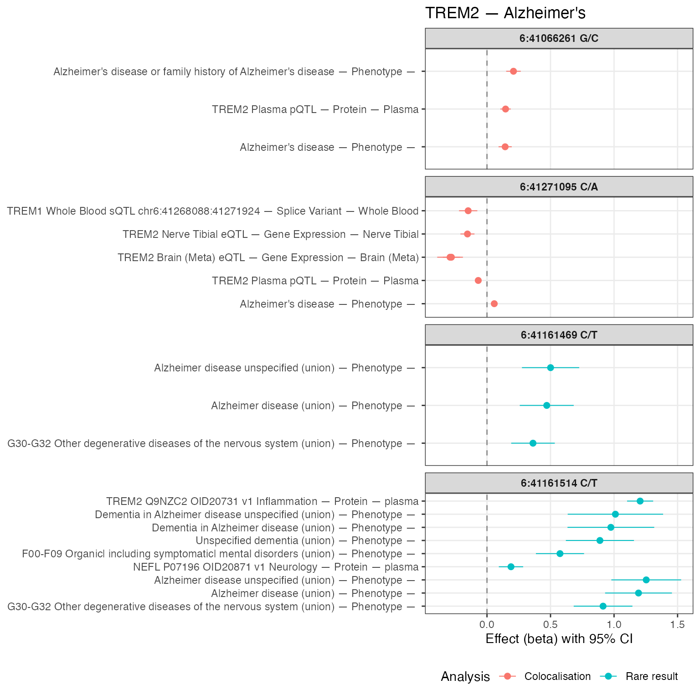

# Using gpmapr

``` r

library(gpmapr)
```

## Introduction

The gpmapr package provides a set of functions to interact with the
GPMap API.

## Getting started

The first port of entry is the `search_gpmap` function. This function
allows you to search for a trait, gene, or variant.

``` r

haemoglobin <- search_gpmap("haemoglobin")
knitr::kable(haemoglobin[, c("name", "sample_size", "num_coloc_groups", "call")])
```

|  | name | sample_size | num_coloc_groups | call |
|:---|:---|---:|---:|:---|
| 43431 | Glycated haemoglobin levels | 146806 | 93 | trait(915) |
| 43436 | Haemoglobin concentration | 563946 | 828 | trait(920) |
| 43438 | Mean corpuscular haemoglobin concentration | 491553 | 297 | trait(922) |
| 43447 | Haemoglobin | 408112 | 757 | trait(931) |
| 44152 | Haemoglobin levels | 445373 | 775 | trait(1636) |
| 44156 | Haemoglobin A1c levels | 437749 | 838 | trait(1640) |
| 44499 | Mean corpuscular haemoglobin | 572863 | 936 | trait(1983) |
| 45100 | Haemoglobin concentration (UKB data field 30020) | 396624 | 658 | trait(2584) |
| 45127 | Glycated haemoglobin HbA1c levels (UKB data field 30750) | 389889 | 721 | trait(2611) |
| 47275 | Haemoglobin concentration | 350474 | 497 | trait(4759) |
| 47277 | Mean corpuscular haemoglobin | 350472 | 628 | trait(4761) |
| 47278 | Mean corpuscular haemoglobin concentration | 350468 | 137 | trait(4762) |
| 52158 | Mean corpuscular haemoglobin | 430998 | 628 | trait(4761) |
| 52788 | Mean corpuscular haemoglobin concentration | 430998 | 137 | trait(4762) |
| 53046 | Glycated haemoglobin HbA1c (30750) | 430998 | 0 | trait(42778) |
| 53057 | Haemoglobin concentration | 430998 | 497 | trait(4759) |

You can see information about the different traits that match your
search, how to subsequently get more information (under `call`), and
metadata about the trait (under `info`).

#### Understanding `info`

- Extractions: Each trait has a number of extractions, related to the
  number of finemapped ld regions that had a p-value \< 1.5e-4.
- Colocalisation Groups: The number of colocalisation groups associated
  with the trait / gene / variant.
- Colocalising Traits: The number of traits that are colocalising with
  the trait / gene / variant.
- Rare Result Groups: Each trait has a number of rare result groups,
  related to the number of groups of rare result groups that had a
  p-value \< 1.5e-4.

You can also search for a gene (by ENSG ID or gene name) or variant (by
CHR:BP or rsID).

``` r

knitr::kable(search_gpmap("SLC44A")[, c("name", "sample_size", "num_study_extractions", "num_coloc_groups", "call")])
```

|  | name | sample_size | num_study_extractions | num_coloc_groups | call |
|:---|:---|---:|---:|---:|:---|
| 1032 | SLC44A1 (ENSG00000070214) | NA | 206 | 9 | gene(‘SLC44A1’) |
| 5825 | SLC44A2 (ENSG00000129353) | NA | 226 | 14 | gene(‘SLC44A2’) |
| 7196 | SLC44A5 (ENSG00000137968) | NA | 91 | 9 | gene(‘SLC44A5’) |
| 7921 | SLC44A3 (ENSG00000143036) | NA | 361 | 17 | gene(‘SLC44A3’) |
| 17220 | SLC44A4 (ENSG00000204385) | NA | 107 | 12 | gene(‘SLC44A4’) |
| 19708 | SLC44A3-AS1 (ENSG00000224081) | NA | 179 | 12 | gene(‘SLC44A3-AS1’) |

``` r

knitr::kable(search_gpmap("22:37042914"))
```

| type | name | type_id | num_coloc_groups | num_coloc_studies | num_rare_results | num_study_extractions | call |
|:---|:---|---:|---:|---:|---:|:---|:---|
| original_variant | 22:37042914 T/C | 5521294 | 0 | 0 | 0 | NA | variant(5521294) |

#### Variant search returns proxy variants

The variant search will return the original variant and any proxy
variants that are in LD with the original variant, which also have
colocalisation results. Each variant is marked as either
`original_variant` or `proxy_variant`. In this example, the original
variant has no colocalisation results, but the proxy variant does. The
proxy variant is also marked as having a r^2 of 0.96

``` r

proxy_variants <- search_gpmap("rs17078078")
knitr::kable(proxy_variants)
```

| type | name | type_id | num_coloc_groups | num_coloc_studies | num_rare_results | num_study_extractions | call |
|:---|:---|---:|---:|---:|---:|:---|:---|
| original_variant | 3:45579683 A/C | 5758009 | 0 | 0 | 0 | NA | variant(5758009) |

## Diving in

You can get more information about a trait by subsequently calling the
[`trait()`](../reference/trait.md), [`gene()`](../reference/gene.md), or
[`variant()`](../reference/variant.md) functions. This will provide you
with the colocalisation results, rare disease results, and study
extractions.

Each trait, gene, or variant call have optional parameters:

- `include_associations`: Whether to include associations (BETA, SE, P)
  of the variants in which it’s colocalised in the output.
- `include_coloc_pairs`: Whether to include coloc pairs in the output
  (which include h3 and h4), as opposed to just the coloc groups.
- `h4_threshold`: The h4 threshold for coloc pairs.

### Trait example

``` r

hemoglobin_trait <- trait(931)
names(hemoglobin_trait)
#> [1] "trait"             "coloc_groups"      "study_extractions"
nrow(hemoglobin_trait$coloc_groups)
#> [1] 27999
nrow(hemoglobin_trait$study_extractions)
#> [1] 1342
```

This returns a list of elements, which you can access by name. More
detailed explanations of the below are described in the API
documentation.

- `trait`: A list containing metadata about the trait, including common
  and rare studies associated with the trait
- `coloc_groups`: a dataframe containing information about which studies
  have coloc results for this trait.
- `study_extractions`: a list of dataframes containing the study
  extractions for this trait.
- `rare_results`: (if they exist) a list of dataframes containing the
  rare results for this trait
- `associations`: (optional) a dataframe containing the associations for
  the variants in which the trait is colocalised
- `coloc_pairs`: (optional) a dataframe containing all pairwise coloc
  results for this trait.

#### How `study_extractions`, `coloc_groups`, and `rare_results` relate

All three layers refer to **study extractions** (GWAS hits in finemapped
LD regions), keyed by `id` in `study_extractions` and by
`study_extraction_id` in `coloc_groups` and `rare_results`.

Think of **`study_extractions`** as the catalogue of extractions linked
to the trait or gene in the map: each row is a study signal at a locus.
Not every listed extraction necessarily has a full colocalisation story
or a rare-disease result row.

- **`coloc_groups`** holds extractions that sit inside a
  **colocalisation group** (shared coloc evidence with other
  studies/traits at that locus). If a study extraction appears here, it
  has coloc-structured results for that entity.
- **`rare_results`** holds extractions that belong to a **rare-result
  group** (rare-disease-style finemapping in the API). The same
  biological signal can, in principle, be reflected in both rare and
  common coloc paths, so overlap between this set of extraction ids and
  those in `coloc_groups` is possible.
- **Neither table:** Some extractions appear only under
  **`study_extractions`**. They are still tied to the trait or gene in
  the genotype–phenotype map (for example via **locus tagging,
  proximity, or other association logic** in the pipeline), but they do
  not currently carry a coloc-group row or a rare-result group row.
  Treat those as “present on the map at this locus” rather than “absent
  by mistake.”

The same idea applies when you call **[`gene()`](../reference/gene.md)**
(or other entity-specific endpoints): `study_extractions` is the wider
catalogue, while `coloc_groups` and `rare_results` subdivide it where
those analyses exist. The table below illustrates counts for the
hemoglobin trait example (`trait(931)`).

``` r

extraction_ids <- function(x) {
  if (is.null(x) || !length(x)) {
    return(integer(0))
  }
  id_col <- if ("id" %in% names(x)) "id" else NULL
  if (!is.null(id_col)) {
    return(unique(stats::na.omit(x[[id_col]])))
  }
  unique(stats::na.omit(unlist(lapply(x, function(df) {
    if (!is.data.frame(df)) {
      return(NULL)
    }
    if ("id" %in% names(df)) {
      return(df[["id"]])
    }
    NULL
  }))))
}

cg_ids <- unique(stats::na.omit(hemoglobin_trait$coloc_groups$study_extraction_id))

rr <- hemoglobin_trait$rare_results
rr_ids <- if (is.null(rr) || !length(rr)) {
  integer(0)
} else {
  unique(stats::na.omit(unlist(lapply(rr, function(d) {
    if (!is.data.frame(d) || !"study_extraction_id" %in% names(d)) {
      return(NULL)
    }
    d[["study_extraction_id"]]
  }))))
}

se_ids <- extraction_ids(hemoglobin_trait$study_extractions)

only_study_extractions <- setdiff(se_ids, union(cg_ids, rr_ids))

knitr::kable(data.frame(
  source = c(
    "Distinct study_extraction_id in coloc_groups",
    "Distinct study_extraction_id in rare_results",
    "In study_extractions only (not in coloc_groups nor rare_results)",
    "Total distinct extraction id in study_extractions"
  ),
  n_extractions = c(
    length(cg_ids),
    length(rr_ids),
    length(only_study_extractions),
    length(se_ids)
  )
))
```

| source | n_extractions |
|:---|---:|
| Distinct study_extraction_id in coloc_groups | 27999 |
| Distinct study_extraction_id in rare_results | 0 |
| In study_extractions only (not in coloc_groups nor rare_results) | 585 |
| Total distinct extraction id in study_extractions | 1342 |

## Gene example

``` r

slc44a1 <- gene("SLC44A1")
names(slc44a1)
#> [1] "gene"              "coloc_groups"      "rare_results"     
#> [4] "variants"          "study_extractions"
nrow(slc44a1$coloc_groups)
#> [1] 80
knitr::kable(head(slc44a1$coloc_groups[, c("coloc_group_id", "trait_name", "data_type", "tissue")]))
```

| coloc_group_id | trait_name | data_type | tissue |
|---:|:---|:---|:---|
| 94137 | Treatment/medication code: dihydrocodeine | Phenotype | NA |
| 94144 | Operative procedures - main OPCS: A52.2 Therapeutic sacral epidural injection | Phenotype | NA |
| 94116 | ABCA1 Blood eQTL | Gene Expression | Blood |
| 94144 | SLC44A1 Muscle Skeletal eQTL | Gene Expression | Muscle Skeletal |
| 94146 | SLC44A1 Lung sQTL chr9:105244904:105299220 | Splice Variant | Lung |
| 94123 | Average diameter for HDL particles | Phenotype | NA |

Note that by default, the gene endpoint includes trans genetic effects.
You can turn this off with `gene("SLC44A1", include_trans = FALSE)`, or
filter `coloc_groups` after the fact (for example `cis_trans == "cis"`
or a `min_p` cutoff).

After you subset rows, some `coloc_group_id` values may be left with
only a single row. Those are no longer meaningful colocalisation
**groups**, so drop them by keeping only groups with more than one row:

``` r

slc44a1_no_trans <- slc44a1
slc44a1_no_trans$coloc_groups <- dplyr::filter(
  slc44a1_no_trans$coloc_groups,
  cis_trans == "cis"
)
# or e.g. dplyr::filter(..., min_p <= 5e-8)

slc44a1_no_trans$coloc_groups <- slc44a1_no_trans$coloc_groups |>
  dplyr::group_by(coloc_group_id) |>
  dplyr::filter(dplyr::n() > 1L) |>
  dplyr::ungroup()

nrow(slc44a1_no_trans$coloc_groups)
#> [1] 26
knitr::kable(head(slc44a1_no_trans$coloc_groups[, c("coloc_group_id", "trait_name", "data_type", "tissue")]))
```

| coloc_group_id | trait_name | data_type | tissue |
|---:|:---|:---|:---|
| 94116 | ABCA1 Blood eQTL | Gene Expression | Blood |
| 94144 | SLC44A1 Muscle Skeletal eQTL | Gene Expression | Muscle Skeletal |
| 94144 | SLC44A1 Skin Not Sun Exposed Suprapubic eQTL | Gene Expression | Skin Not Sun Exposed Suprapubic |
| 94136 | SLC44A1 Skin Sun Exposed Lower leg sQTL chr9:105385502:105438281 | Splice Variant | Skin Sun Exposed Lower leg |
| 94144 | SLC44A1 Brain Hippocampus sQTL chr9:105299937:105309724 | Splice Variant | Brain Hippocampus |
| 94144 | SLC44A1 Lung eQTL | Gene Expression | Lung |

### Coloc pairs example

Although coloc groups provide a helpful overview of the colocalisation
results for a gene, you may want to look at the pairwise relationships
between the studies. You can do this by setting
`include_coloc_pairs = TRUE` in the call.

As there may be many coloc pairs, the results are not as fleshed out as
the coloc groups. You may have to filter the results to get the
information you need, or join with the study extractions to get the full
picture.

``` r

slc44a1_coloc_pairs <- gene("SLC44A1", include_coloc_pairs = TRUE)
nrow(slc44a1_coloc_pairs$coloc_pairs)
#> [1] 1096
knitr::kable(head(slc44a1_coloc_pairs$coloc_pairs[, c("study_extraction_a_id", "study_extraction_b_id", "h4")]))
```

| study_extraction_a_id | study_extraction_b_id |        h4 |
|----------------------:|----------------------:|----------:|
|               2469380 |               2469454 | 0.9971425 |
|               2469380 |               2469455 | 0.9969158 |
|               2469454 |               2469455 | 0.9999984 |
|               2469454 |               2469769 | 0.9071751 |
|               2469454 |               2469816 | 0.8388802 |
|               2469454 |               2469956 | 0.9998948 |

``` r


study_extractions_tbl <- dplyr::bind_rows(slc44a1_no_trans$study_extractions)
study_extractions_subset <- dplyr::select(study_extractions_tbl, id, trait_name, min_p)

hydrated_coloc_pairs <- slc44a1_coloc_pairs$coloc_pairs |>
  dplyr::left_join(slc44a1_coloc_pairs$study_extractions, by = c("study_extraction_a_id" = "id")) |>
  dplyr::rename(trait_a = trait_name) |>
  dplyr::left_join(slc44a1_coloc_pairs$study_extractions, by = c("study_extraction_b_id" = "id")) |>
  dplyr::rename(trait_b = trait_name)

knitr::kable(head(hydrated_coloc_pairs[, c("trait_a", "trait_b", "h4")]))
```

| trait_a | trait_b | h4 |
|:---|:---|---:|
| HDL cholesterol | Apolipoprotein A1 levels | 0.9971425 |
| HDL cholesterol | HDL cholesterol levels | 0.9969158 |
| Apolipoprotein A1 levels | HDL cholesterol levels | 0.9999984 |
| Apolipoprotein A1 levels | Phospholipids to total lipids ratio in large HDL | 0.9071751 |
| Apolipoprotein A1 levels | Phospholipids to total lipids ratio in medium HDL | 0.8388802 |
| Apolipoprotein A1 levels | SLC44A1 Blood eQTL | 0.9998948 |

## Using Pleiotropy Scores and Directionality to uncover genetic insights from colocalisation findings

For the gene, distinct_trait_categories and
distinct_protein_coding_genes are available and automatically are
returned when you call [`gene()`](../reference/gene.md). These are the
number of trait categories and protein coding genes that the gene is
associated with via coloc groups.

``` r

trem2 <- gene("TREM2", include_associations = TRUE)
trem2$gene$distinct_trait_categories
#> [1] 1
trem2$gene$distinct_protein_coding_genes
#> [1] 2
```

We can see that TREM2 is associated with only one trait category, and
two other protein coding genes, TREM1 and TREML2.

Furthermore, if we look at the colocalization group that is associated
with Alzheimer’s disease, we can see that the associations are such that
any decrease in the expression of TREM2 is associated with an increase
in Alzheimer’s disease.

``` r


alzheimer_trait_ids <- search_gpmap("alzheimer")$type_id
trem2_alzheimer_coloc_group_ids <- unique(
  trem2$coloc_groups[trem2$coloc_groups$trait_id %in% alzheimer_trait_ids, ]$coloc_group_id
)
trem2_alzheimer_rare_result_group_ids <- unique(
  trem2$rare_results[trem2$rare_results$trait_id %in% alzheimer_trait_ids, ]$rare_result_group_id
)
trem2_alzheimer_groups <- trem2$coloc_groups[
  trem2$coloc_groups$coloc_group_id %in% trem2_alzheimer_coloc_group_ids,
]
trem2_alzheimer_rare_results <- trem2$rare_results[
  trem2$rare_results$rare_result_group_id %in% trem2_alzheimer_rare_result_group_ids,
]
```

We can see 2 colocalization groups and 2 rare result groups are
associated with Alzheimer’s disease, and TREM2 are not associated with
any other trait categories.

Here we have made a forest plot of the association betas relating to
Alzheimer’s disease, combining **colocalisation groups** (one panel per
`coloc_group_id`) and **rare disease result groups** (facet strip shows
the **SNP** from `display_snp`, or `variant_id` if needed).

``` r

forest_row_label <- function(trait_name, data_type, tissue) {
  tn <- if (missing(tissue) || is.null(tissue)) {
    rep(NA_character_, length(trait_name))
  } else {
    tissue
  }
  paste(
    trait_name,
    data_type,
    tidyr::replace_na(as.character(tn), ""),
    sep = " — "
  )
}

trem2_forest_coloc <- trem2_alzheimer_groups |>
  dplyr::filter(!is.na(.data$beta), !is.na(.data$se), .data$se > 0) |>
  dplyr::mutate(
    lo = .data$beta - 1.96 * .data$se,
    hi = .data$beta + 1.96 * .data$se,
    row_label = forest_row_label(.data$trait_name, .data$data_type, .data$tissue),
    panel_id = dplyr::coalesce(
      as.character(.data$display_snp),
      paste0("variant ", as.character(.data$variant_id))
    ),
    analysis = "Colocalisation"
  ) |>
  dplyr::group_by(.data$coloc_group_id) |>
  dplyr::arrange(.data$beta, .by_group = TRUE) |>
  dplyr::mutate(
    row_label = factor(.data$row_label, levels = unique(.data$row_label))
  ) |>
  dplyr::ungroup()

trem2_forest_rare <- if (is.null(trem2_alzheimer_rare_results) || nrow(trem2_alzheimer_rare_results) == 0L) {
  NULL
} else {
  rr <- trem2_alzheimer_rare_results
  if (!"tissue" %in% names(rr)) {
    rr$tissue <- NA_character_
  }
  rr |>
    dplyr::filter(!is.na(.data$beta), !is.na(.data$se), .data$se > 0) |>
    dplyr::mutate(
      lo = .data$beta - 1.96 * .data$se,
      hi = .data$beta + 1.96 * .data$se,
      row_label = forest_row_label(.data$trait_name, .data$data_type, .data$tissue),
      panel_id = dplyr::coalesce(
        as.character(.data$display_snp),
        paste0("variant ", as.character(.data$variant_id))
      ),
      analysis = "Rare result"
    ) |>
    dplyr::group_by(.data$panel_id) |>
    dplyr::arrange(.data$beta, .by_group = TRUE) |>
    dplyr::mutate(
      row_label = factor(.data$row_label, levels = unique(.data$row_label))
    ) |>
    dplyr::ungroup()
}

trem2_forest <- dplyr::bind_rows(
  trem2_forest_coloc,
  trem2_forest_rare
) |>
  dplyr::mutate(
    panel_id = factor(.data$panel_id, levels = unique(.data$panel_id))
  )

ggplot2::ggplot(trem2_forest, ggplot2::aes(x = beta, y = row_label, colour = analysis)) +
  ggplot2::geom_vline(xintercept = 0, linetype = 2, colour = "grey55") +
  ggplot2::geom_errorbarh(
    ggplot2::aes(xmin = lo, xmax = hi),
    height = 0,
    linewidth = 0.35
  ) +
  ggplot2::geom_point(size = 2) +
  ggplot2::facet_wrap(~ panel_id, scales = "free_y", ncol = 1) +
  ggplot2::labs(
    x = "Effect (beta) with 95% CI",
    y = NULL,
    colour = "Analysis",
    title = "TREM2 — Alzheimer's"
  ) +
  ggplot2::theme_bw() +
  ggplot2::theme(
    strip.text = ggplot2::element_text(face = "bold"),
    panel.grid.minor = ggplot2::element_blank(),
    legend.position = "bottom"
  )
#> Warning: `geom_errorbarh()` was deprecated in ggplot2 4.0.0.
#> ℹ Please use the `orientation` argument of `geom_errorbar()` instead.
#> This warning is displayed once per session.
#> Call `lifecycle::last_lifecycle_warnings()` to see where this warning was
#> generated.
#> `height` was translated to `width`.
```



We now have a good overview of the use of TREM2 as a mechanism to
investigate, and potentially target for Alzheimer’s disease. We now
know:

- TREM2 is associated with Alzheimer’s disease
- TREM2 is associated with two other protein coding genes, TREM1 and
  TREML2, but there is no evidence of colocalisation with any other
  nearby genes.
- TREM2 is not associated with any other trait categories, or even any
  other traits.
- The direction of effect between TREM2 and Alzheimer’s disease seems to
  be complex. In 3 instances, an increase in the expression of TREM2 is
  associated with an increase in Alzheimer’s disease, and in 1 instance,
  a decrease in the expression of TREM2 (across many gene expression,
  splice variants, and protein levels) is associated with an increase in
  Alzheimer’s disease.

Existing literature has shown that TREM2 is associated with Alzheimer’s
disease, and that TREM2 is currently being investigated as a potential
target for Alzheimer’s disease.

Although the GPMap can not provide a definitive answer as a drug target
for Alzheimer’s disease, it has proven to helpful in illuminating the
potential pleiotropy, and of the directionality of effect that
perturbing specific variants associated with TREM2 may have.

## Accessing summary statistics

You can only access the summary statistics via
[`variant()`](../reference/variant.md), by including
`include_summary_stats = TRUE` in the call. This is to limit the amount
of data that can be returned from the API for cost reasons. If you
attempt to download too many summary statistics, you may be blocked from
the API.

- `variant(1669064, include_summary_stats = TRUE)`

Instead, if you are interested in accessing all the summary statistics,
or the whole database of results, you can download all databases and
summary statistics the [Google Cloud Storage
Bucket](https://console.cloud.google.com/storage/browser/genotype-phenotype-map),
and can find an [explanation of the files
here](https://github.com/MRCIEU/genotype-phenotype-map/wiki/Public-Data-Bucket).
Note that the bucket is ‘requester pays’, so you will need to have a
Google Cloud account and be logged in to download the files.
