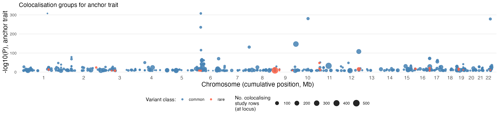
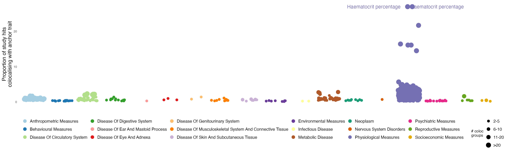
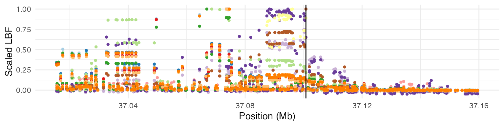
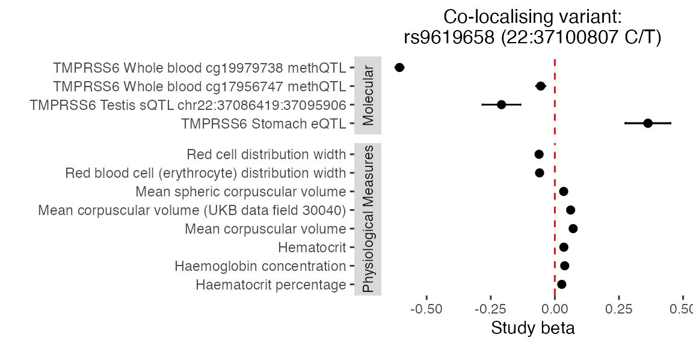
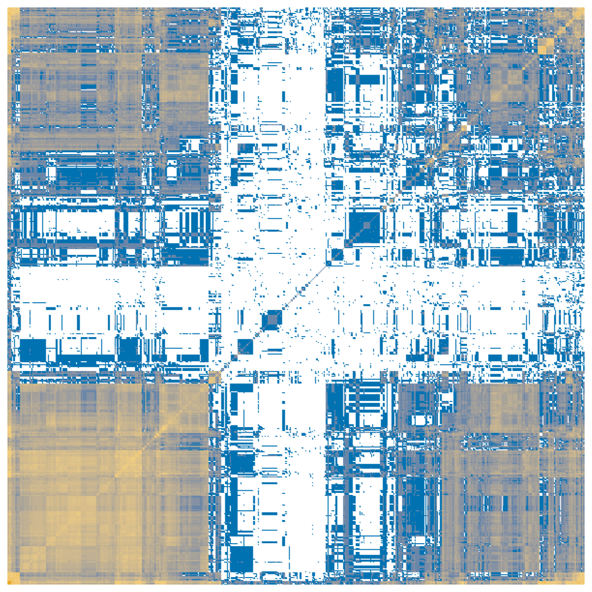

# GPMap tutorial: Haemoglobin concentration case study

This is a case study of GPMAP genetic colocalisations with the UK
Biobank complex trait “Haemoglobin concentration”, a physiological
measure underpinned by well understood biological mechanisms of iron
uptake, handling and storage and erythropoiesis, which potentially sits
downstream of many disease states.

This vignette is a demonstrative example of Figure 4 in [the GPMap
paper](https://doi.org/10.64898/2026.02.19.26346618).

We wish to demonstrate that the GPMap:

- Returns relevant colocalising signals between a physiological state
  and the molecular features/genes involved in regulation of that state
- Improves understanding of the diverse factors contributing to trait
  variability by enabling colocalising complex traits to be clustered
  based on the signals they share
- Can reveal new biology/avenues for therapeutic intervention

## Trait colocalisations

**Anchor trait:** Haemoglobin concentration (id: 4759)

``` r

all_genes <- gpmapr::all_genes()
all_traits_df <- gpmapr::all_traits()
all_haemoglobin_traits <- gpmapr::search_gpmap("haemoglobin") |>
  dplyr::select(type_id, type, name, sample_size, num_coloc_groups)
anchor_trait_id <- 4759

trait_results <- gpmapr::trait(trait_id = anchor_trait_id)
haemoglobin_common <- trait_results$coloc_groups
haemoglobin_rare <- trait_results$rare_results
knitr::kable(all_haemoglobin_traits)
```

|  | type_id | type | name | sample_size | num_coloc_groups |
|:---|:---|:---|:---|---:|---:|
| 43431 | 915 | trait | Glycated haemoglobin levels | 146806 | 93 |
| 43436 | 920 | trait | Haemoglobin concentration | 563946 | 828 |
| 43438 | 922 | trait | Mean corpuscular haemoglobin concentration | 491553 | 297 |
| 43447 | 931 | trait | Haemoglobin | 408112 | 757 |
| 44152 | 1636 | trait | Haemoglobin levels | 445373 | 775 |
| 44156 | 1640 | trait | Haemoglobin A1c levels | 437749 | 838 |
| 44499 | 1983 | trait | Mean corpuscular haemoglobin | 572863 | 936 |
| 45100 | 2584 | trait | Haemoglobin concentration (UKB data field 30020) | 396624 | 658 |
| 45127 | 2611 | trait | Glycated haemoglobin HbA1c levels (UKB data field 30750) | 389889 | 721 |
| 47275 | 4759 | trait | Haemoglobin concentration | 350474 | 497 |
| 47277 | 4761 | trait | Mean corpuscular haemoglobin | 350472 | 628 |
| 47278 | 4762 | trait | Mean corpuscular haemoglobin concentration | 350468 | 137 |
| 52158 | 4761 | trait | Mean corpuscular haemoglobin | 430998 | 628 |
| 52788 | 4762 | trait | Mean corpuscular haemoglobin concentration | 430998 | 137 |
| 53046 | 42778 | trait | Glycated haemoglobin HbA1c (30750) | 430998 | 0 |
| 53057 | 4759 | trait | Haemoglobin concentration | 430998 | 497 |

Exclude duplicate haemoglobin traits and filter on genome-wide
significance:

``` r

# Identify other haemoglobin traits to exclude
trait_ids_hgb <- dplyr::filter(all_haemoglobin_traits, type_id != 4759)
traits_out <- trait_ids_hgb$type_id

# Exclude coloc groups where the anchor trait has no genome-wide significant hit in the region
colocs_out_common <- haemoglobin_common |>
  dplyr::filter(trait_id == anchor_trait_id & min_p > 5e-8) |>
  dplyr::pull(coloc_group_id)

colocs_out_rare <- haemoglobin_rare |>
  dplyr::filter(trait_id == anchor_trait_id & min_p > 5e-8) |>
  dplyr::pull(rare_result_group_id)

haemoglobin_common <- haemoglobin_common |>
  dplyr::filter(!(trait_id %in% traits_out), min_p < 5e-8,
                !(coloc_group_id %in% colocs_out_common))
haemoglobin_rare <- haemoglobin_rare |>
  dplyr::filter(!(trait_id %in% traits_out), min_p < 5e-8,
                !(rare_result_group_id %in% colocs_out_rare))

# Remove coloc/rare groups with only one study after filtering
solo_common <- names(table(haemoglobin_common$coloc_group_id))[table(haemoglobin_common$coloc_group_id) == 1]
haemoglobin_common <- haemoglobin_common |> dplyr::filter(!(coloc_group_id %in% solo_common))
solo_rare <- names(table(haemoglobin_rare$rare_result_group_id))[table(haemoglobin_rare$rare_result_group_id) == 1]
haemoglobin_rare <- haemoglobin_rare |> dplyr::filter(!(rare_result_group_id %in% solo_rare))
```

### Genome view

Colocalising signals across the genome, annotated by variant class and
number of colocalising studies:

``` r

n_per_locus_common <- haemoglobin_common |>
  dplyr::group_by(display_snp, chr, bp) |>
  dplyr::summarise(n_studies = dplyr::n(), .groups = "drop")

common_colocs_per_position <- haemoglobin_common |>
  dplyr::filter(trait_id == anchor_trait_id) |>
  dplyr::group_by(display_snp, chr, bp) |>
  dplyr::summarise(min_p = min(min_p, na.rm = TRUE), .groups = "drop") |>
  dplyr::inner_join(n_per_locus_common, by = c("display_snp", "chr", "bp")) |>
  dplyr::mutate(
    neg_log10_p = -log10(pmax(min_p, .Machine$double.xmin)),
    variant_type = "common"
  )

n_per_locus_rare <- haemoglobin_rare |>
  dplyr::group_by(display_snp, chr, bp) |>
  dplyr::summarise(n_studies = dplyr::n(), .groups = "drop")

rare_colocs_per_position <- haemoglobin_rare |>
  dplyr::filter(trait_id == anchor_trait_id) |>
  dplyr::group_by(display_snp, chr, bp) |>
  dplyr::summarise(min_p = min(min_p, na.rm = TRUE), .groups = "drop") |>
  dplyr::inner_join(n_per_locus_rare, by = c("display_snp", "chr", "bp")) |>
  dplyr::mutate(
    neg_log10_p = -log10(pmax(min_p, .Machine$double.xmin)),
    variant_type = "rare"
  )

colocs_per_position <- dplyr::bind_rows(common_colocs_per_position,
                                        rare_colocs_per_position) |>
  dplyr::mutate(chr_lab = as.character(chr))

chr_order_lbl <- c(as.character(1:22), "X", "Y")
chr_offsets <- all_genes |>
  dplyr::mutate(chr_lab = as.character(chr)) |>
  dplyr::group_by(chr_lab) |>
  dplyr::summarise(chr_len = max(stop, na.rm = TRUE), .groups = "drop") |>
  dplyr::mutate(
    ord = match(chr_lab, chr_order_lbl),
    ord = dplyr::if_else(is.na(ord), 999L, ord)
  ) |>
  dplyr::arrange(ord, chr_lab) |>
  dplyr::mutate(offset = cumsum(c(0, utils::head(chr_len, -1))))

colocs_per_position <- colocs_per_position |>
  dplyr::left_join(chr_offsets, by = "chr_lab") |>
  dplyr::mutate(x_mbp = (bp + offset) / 1e6)

axis_chr <- chr_offsets |>
  dplyr::filter(chr_lab %in% unique(colocs_per_position$chr_lab)) |>
  dplyr::mutate(x_mbp_mid = (offset + chr_len / 2) / 1e6) |>
  dplyr::arrange(ord)

colocs_per_position |>
  ggplot2::ggplot(ggplot2::aes(x = x_mbp, y = neg_log10_p,
                                colour = variant_type, size = n_studies)) +
  ggplot2::geom_point(alpha = 0.85) +
  ggplot2::scale_colour_manual(name = "Variant class:",
                               values = c(common = "steelblue", rare = "tomato")) +
  ggplot2::scale_size_continuous(name = "No. colocalising\nstudy rows\n(at locus)") +
  ggplot2::scale_x_continuous(
    breaks = axis_chr$x_mbp_mid,
    labels = axis_chr$chr_lab,
    expand = ggplot2::expansion(mult = c(0.01, 0.01))
  ) +
  ggplot2::theme_minimal() +
  ggplot2::theme(axis.text.x = ggplot2::element_text(size = 11),
                 axis.title = ggplot2::element_text(size = 14),
                 panel.grid.major.x = ggplot2::element_blank(),
                 panel.grid.minor = ggplot2::element_blank(),
                 legend.position = "bottom") +
  ggplot2::labs(
    x = "Chromosome (cumulative position, Mb)",
    y = "-log10(P), anchor trait",
    title = "Colocalisation groups for anchor trait"
  )
```



This is a recreation of the data you can see on the GPMap website at
<https://gpmap.opengwas.io/trait.html?id=4759>

### Complex trait colocalisations

Traits across which trait categories show the greatest proportion of GWS
hits colocalising with the anchor trait:

``` r

pull_trait_ids_common <- haemoglobin_common |>
  dplyr::filter(data_type %in% c("Cell Trait", "Plasma Protein", "Phenotype")) |>
  dplyr::select(trait_id, trait_name, data_type, trait_category) |>
  dplyr::distinct()

# Use num_study_extractions from all_traits as a proxy for GWS hits per trait
n_studyhits_common <- all_traits_df |>
  dplyr::select(trait_id = id, n_studyhits = num_study_extractions) |>
  dplyr::filter(trait_id %in% pull_trait_ids_common$trait_id)

common_colocs_per_trait <- haemoglobin_common |>
  dplyr::group_by(trait_id) |>
  dplyr::summarise(n_colocs = dplyr::n(), .groups = "drop") |>
  dplyr::inner_join(pull_trait_ids_common, by = "trait_id") |>
  dplyr::inner_join(n_studyhits_common, by = "trait_id") |>
  dplyr::filter(trait_id != anchor_trait_id, n_colocs > 1, !is.na(trait_category),
                n_studyhits > 0) |>
  dplyr::mutate(
    prop_colocing_hits = (n_colocs / n_studyhits) * 100,
    colocs_cut = cut(n_colocs, breaks = c(1, 5, 10, 20, Inf))
  ) |>
  dplyr::arrange(trait_category, dplyr::desc(prop_colocing_hits)) |>
  dplyr::group_by(trait_category) |>
  dplyr::mutate(label = stringr::str_wrap(
    ifelse((prop_colocing_hits == max(prop_colocing_hits) & prop_colocing_hits > 10) |
             prop_colocing_hits > 25, trait_name, NA),
    width = 25
  )) |>
  dplyr::ungroup()

n_cats <- length(unique(common_colocs_per_trait$trait_category))
cols_cats <- setNames(
  c(RColorBrewer::brewer.pal(min(12, n_cats), "Paired"),
    if (n_cats > 12) RColorBrewer::brewer.pal(n_cats - 12, "Dark2") else character(0)),
  unique(common_colocs_per_trait$trait_category)
)
cols_cats <- c(cols_cats, Molecular = "bisque")

cut_groups <- c("(1,5]" = "2-5", "(5,10]" = "6-10", "(10,20]" = "11-20", "(20,Inf]" = ">20")

set.seed(40)
pos <- ggplot2::position_jitter(width = 0.4, height = 0)

common_colocs_per_trait |>
  ggplot2::ggplot(ggplot2::aes(x = trait_category, y = prop_colocing_hits,
                               colour = trait_category)) +
  ggplot2::geom_jitter(position = pos, ggplot2::aes(size = colocs_cut)) +
  ggrepel::geom_text_repel(ggplot2::aes(label = label),
                           position = pos, force = 20, max.overlaps = Inf,
                           point.padding = ggplot2::unit(0.5, "lines"),
                           box.padding = ggplot2::unit(0.5, "lines"),
                           size = 5, show.legend = FALSE) +
  ggplot2::scale_size_manual(name = "# coloc\ngroups", values = 3:9, labels = cut_groups) +
  ggplot2::scale_colour_manual(name = "", values = cols_cats) +
  ggplot2::theme_minimal() +
  ggplot2::theme(axis.text.x = ggplot2::element_blank(),
                 axis.title = ggplot2::element_text(size = 15),
                 panel.grid = ggplot2::element_blank(),
                 legend.position = "bottom",
                 legend.text = ggplot2::element_text(size = 12)) +
  ggplot2::labs(x = "", y = "Proportion of study hits\ncolocalising with anchor trait") +
  ggplot2::guides(colour = ggplot2::guide_legend(ncol = 6,
                                                 override.aes = list(size = 4)),
                  size = ggplot2::guide_legend(ncol = 1))
```



## Investigating a specific colocalisation group

### TMPRSS6: eQTL/mQTL/sQTL and physiological measures

TMPRSS6 is a negative regulator of the iron homeostasis hormone hepcidin
(HAMP).

``` r

# Filter to TMPRSS6 coloc groups
tmprss6_coloc_group_ids <- haemoglobin_common |>
  dplyr::filter(gene == "TMPRSS6") |>
  dplyr::pull(coloc_group_id) |>
  unique()

haemoglobin_tmprss6_all <- haemoglobin_common |>
  dplyr::filter(coloc_group_id %in% tmprss6_coloc_group_ids)

# Find the coloc group which has the most distinct data types
tmprss6_richest_coloc_id <- haemoglobin_tmprss6_all |>
  dplyr::group_by(coloc_group_id) |>
  dplyr::summarise(n_data_types = dplyr::n_distinct(data_type), .groups = "drop") |>
  dplyr::arrange(dplyr::desc(n_data_types), coloc_group_id) |>
  dplyr::slice(1) |>
  dplyr::pull(coloc_group_id)

haemoglobin_tmprss6 <- haemoglobin_tmprss6_all |>
  dplyr::filter(coloc_group_id == tmprss6_richest_coloc_id)

variant_id_tmprss6 <- haemoglobin_tmprss6$variant_id |> unique() |> head(1)
bp_tmprss6 <- haemoglobin_tmprss6$bp[1]

# Fetch summary statistics for the LD block containing the candidate SNP.
# summary_stats is a named list keyed by study_id; columns are uppercase (BP, SE, LBF_1, SNP, BETA, ...).
tmprss6_variant <- gpmapr::variant(variant_id_tmprss6, include_summary_stats = TRUE)

# Trait labels live on coloc_groups, not always on variant$study_extractions
se_tmprss6 <- tmprss6_variant$study_extractions |>
  dplyr::filter(id %in% haemoglobin_tmprss6$study_extraction_id)

meta_tmprss6 <- haemoglobin_tmprss6 |>
  dplyr::select(study_id, study_extraction_id, trait_id, trait_name, trait_category, data_type) |>
  dplyr::distinct()
```

The GPMap found the candidate SNP to be 22:37100807_C_T, which VEP has
annotated as an intron_variant of TMPRSS6.

### Region plot: scaled LBF values across all studies in the coloc group

``` r


tmprss6_gene <- all_genes |>
  dplyr::filter(gene == "TMPRSS6")

plot_region <- function(se_data, summary_stats, bp_min, bp_max, tag_snp_bp) {
  cols <- c(RColorBrewer::brewer.pal(12, "Paired"), RColorBrewer::brewer.pal(8, "Dark2"))

  regions <- dplyr::bind_rows(lapply(seq_len(nrow(se_data)), function(i) {
    ss <- summary_stats[[as.character(se_data$study_id[i])]]
    if (is.null(ss) || !"LBF_1" %in% names(ss)) return(NULL)
    ss <- ss |>
      dplyr::filter(SE != 1) |>  # Remove padded points for GoDMC studies
      dplyr::mutate(trait_id   = se_data$trait_id[i],
                    scaled_LBF = LBF_1 / max(abs(LBF_1), na.rm = TRUE))
    return(ss)
  }))

  if (nrow(regions) == 0) {
    stop("No summary statistics rows to plot; check study_id vs summary_stats names.")
  }

  p <- ggplot2::ggplot(regions,
                       ggplot2::aes(x = BP / 1e6, y = scaled_LBF,
                                    colour = as.factor(trait_id))) +
    ggplot2::geom_point(size = 1) +
    ggplot2::geom_vline(xintercept = tag_snp_bp / 1e6) +
    ggplot2::scale_x_continuous(limits = c(bp_min / 1e6, bp_max / 1e6)) +
    ggplot2::scale_colour_manual(name = "trait",
                                 values = cols[seq_len(length(unique(regions$trait_id)))]) +
    ggplot2::theme_minimal() +
    ggplot2::theme(legend.position = "none") +
    ggplot2::labs(x = "Position (Mb)", y = "Scaled LBF")
  return(p)
}

plot_region(se_tmprss6,
  tmprss6_variant$summary_stats,
  bp_min = tmprss6_gene$start - 50000,
  bp_max = tmprss6_gene$stop + 50000,
  tag_snp_bp = bp_tmprss6
)
```



We can also plot the effect estimates at the candidate SNP across the
colocalising studies.

``` r

# Effect estimates at candidate SNP across colocalising studies
plot_coloc_betas <- function(betas, title) {
  if (nrow(betas) == 0 || !"trait_category" %in% names(betas)) {
    stop("No beta rows or missing trait_category after join to coloc_groups metadata.")
  }
  betas <- dplyr::filter(betas, !is.na(trait_category), !is.na(trait_name))
  p <- betas |>
    ggplot2::ggplot(ggplot2::aes(y = trait_name, x = beta_alt)) +
    ggplot2::geom_vline(xintercept = 0, colour = "red", lty = 2) +
    ggplot2::geom_point(size = 2) +
    ggplot2::geom_errorbar(ggplot2::aes(xmin = beta_alt - 1.96 * .data[["SE"]],
                                        xmax = beta_alt + 1.96 * .data[["SE"]]),
                           width = 0.1) +
    ggplot2::facet_grid(trait_category ~ ., scale = "free", space = "free",
                        switch = "y") +
    ggplot2::theme_bw() +
    ggplot2::theme(panel.grid = ggplot2::element_blank(),
                   panel.border = ggplot2::element_blank(),
                   strip.background = ggplot2::element_rect(colour = NA),
                   plot.title = ggplot2::element_text(hjust = 0.5, size = 12)) +
    ggplot2::labs(x = "Study beta", y = "", title = title)
  return(p)
}

betas_tmprss6 <- dplyr::bind_rows(lapply(seq_len(nrow(se_tmprss6)), function(i) {
  ss <- tmprss6_variant$summary_stats[[as.character(se_tmprss6$study_id[i])]]
  if (is.null(ss)) return(NULL)
  ss <- ss |>
    dplyr::filter(grepl("^22:37100807", SNP)) |>
    dplyr::mutate(
      beta_alt = BETA * -1,
      study_id = se_tmprss6$study_id[i]
    )
  return(ss)
})) |>
  dplyr::left_join(meta_tmprss6, by = "study_id") |>
  dplyr::mutate(
    trait_category = dplyr::if_else(data_type != "Phenotype", "Molecular", trait_category)
  )

plot_coloc_betas(betas_tmprss6,
                 title = "Co-localising variant:\nrs9619658 (22:37100807 C/T)")
```



## Trait clustering

Of all the traits that colocalise with the anchor, how many coloc groups
do each pair of traits share?

``` r

# Remove duplicates crudely by name
traits_keep <- common_colocs_per_trait |>
  dplyr::mutate(name_cut = sub(" \\(.*\\)", "", trait_name)) |>
  dplyr::arrange(name_cut, dplyr::desc(n_studyhits)) |>
  dplyr::filter(!duplicated(name_cut)) |>
  dplyr::pull(trait_id)

# Compute pairwise shared coloc groups
trait_pairs <- expand.grid(trait1 = traits_keep, trait2 = traits_keep,
                           stringsAsFactors = FALSE)
traits_by_group <- split(haemoglobin_common$trait_id, haemoglobin_common$coloc_group_id)

trait_pairs$shared_colocs <- apply(trait_pairs, 1, function(x) {
  t1 <- x["trait1"]
  t2 <- x["trait2"]
  return(sum(vapply(traits_by_group, function(v) t1 %in% v & t2 %in% v, logical(1))))
})

# Convert to matrix, cluster, and reorder
mx_colocs <- reshape2::acast(trait_pairs, trait1 ~ trait2, value.var = "shared_colocs")
mx_clust  <- hclust(dist(mx_colocs))
mx_colocs <- mx_colocs[mx_clust$order, mx_clust$order]

mx_colocs_melt <- reshape2::melt(mx_colocs)
colnames(mx_colocs_melt) <- c("trait1", "trait2", "coloc_hits")
mx_colocs_melt <- mx_colocs_melt |>
  dplyr::mutate(log_coloc_hits = dplyr::if_else(coloc_hits == 0, NA_real_,
                                                log10(coloc_hits)))

ggplot2::ggplot(mx_colocs_melt,
                ggplot2::aes(
                  x = factor(trait1, levels = unique(mx_colocs_melt$trait1)),
                  y = factor(trait2, levels = unique(mx_colocs_melt$trait1)),
                  colour = log_coloc_hits
                )) +
  ggplot2::geom_point(shape = 20, size = 0.2) +
  ggplot2::scale_colour_gradient2(name = "log10(no. colocalising SNPs)",
                                  low = "#0072B2", high = "#E69F00",
                                  mid = "#F3CF80", midpoint = 1.3,
                                  na.value = "white") +
  ggplot2::theme_minimal() +
  ggplot2::theme(legend.position = "none",
                 axis.title = ggplot2::element_blank(),
                 panel.grid = ggplot2::element_blank(),
                 axis.text = ggplot2::element_blank())
```



We can also view the specific clusters that were found.

``` r

# Define how many clusters you want (adjust 'k' as needed)
n_clusters <- 10
cluster_assignments <- stats::cutree(mx_clust, k = n_clusters)

# cutree names are character rownames; trait_id in common_colocs_per_trait is integer
trait_clusters <- dplyr::tibble(
  trait_id = as.integer(names(cluster_assignments)),
  cluster_id = as.factor(unname(cluster_assignments))
) |>
  dplyr::left_join(
    common_colocs_per_trait |>
      dplyr::select(trait_id, trait_name) |>
      dplyr::distinct(),
    by = "trait_id"
  ) |>
  dplyr::arrange(cluster_id)

# View the groups in a condensed format (truncate long trait lists for readability)
grouped_summary <- trait_clusters |>
  dplyr::group_by(cluster_id) |>
  dplyr::summarize(
    traits = stringr::str_trunc(
      paste(stats::na.omit(trait_name), collapse = ", "),
      width = 500
    ),
    .groups = "drop"
  )

knitr::kable(grouped_summary)
```

| cluster_id | traits |
|:---|:---|
| 1 | Coronary artery disease, Glomerular filtration rate (creatinine), Glomerular filtration rate in non diabetics (creatinine), Granulocyte percentage of myeloid white cells, Eosinophil percentage of granulocytes, Neutrophil percentage of granulocytes, Sum eosinophil basophil counts, Lymphocyte counts, Basophil percentage of granulocytes, Squamous cell lung carcinoma, Fasting blood glucose, Offspring birth weight, Total body bone mineral density, Atrial fibrillation, Cognitive performance, Parent… |
| 2 | Sum neutrophil eosinophil counts, Granulocyte count, Sum basophil neutrophil counts, Myeloid white cell count, Appendicular lean mass, Lymphocyte count, Monocyte count, Neutrophil count, Lymphocyte percentage of white cells, Bilirubin levels, White blood cell count (lymphocyte), Mean platelet volume, Platelet distribution width, Height, Diastolic blood pressure, Systolic blood pressure, Total bilirubin levels (UKB data field 30840), High blood pressure (UKB data field 6150) (SPA correction), … |
| 3 | Hematocrit |
| 4 | Red blood cell count, Red blood cell erythrocyte count (UKB data field 30010) |
| 5 | Red cell distribution width, Plateletcrit, Mean reticulocyte volume, Platelet count, Mean corpuscular volume (UKB data field 30040), Red blood cell (erythrocyte) distribution width, Platelet crit, Immature reticulocyte fraction |
| 6 | High light scatter reticulocyte percentage of red cells, Mean spheric corpuscular volume, Reticulocyte fraction of red cells, Immature fraction of reticulocytes, Reticulocyte count, High light scatter reticulocyte count, Mean sphered cell volume, Reticulocyte percentage, High light scatter reticulocyte percentage |
| 7 | Low density lipoprotein cholesterol levels, Liver enzyme levels (alanine transaminase), Gamma glutamyl transpeptidase, HDL cholesterol, Triglycerides, Apolipoprotein A1 levels, HDL cholesterol levels, Gamma glutamyl transferase levels, Cholesteryl ester levels in HDL, Free cholesterol levels in HDL, Total lipid levels in HDL, Phospholipid levels in HDL, Average diameter for HDL particles, Triglyceride levels in HDL, Cholesterol to total lipids ratio in IDL, Cholesteryl esters to total lipids … |
| 8 | Sex hormone-binding globulin levels adjusted for BMI, Serum alkaline phosphatase levels, Total cholesterol levels, Direct low density lipoprotein cholesterol levels, Sex hormone-binding globulin levels, Insulin-like growth factor 1 levels, Serum albumin levels, Waist-to-hip ratio adjusted for BMI, Waist-hip ratio, Cardiovascular disease, High cholesterol, Ratio of apolipoprotein B to apolipoprotein A1 levels, Total cholines levels, Concentration of HDL particles, Cholesterol levels in IDL, Ch… |
| 9 | Blood urea nitrogen levels, Serum uric acid levels, Serum creatinine levels, Serum urea levels, Estimated glomerular filtration rate (creatinine), Urea levels (UKB data field 30670), Creatinine levels (UKB data field 30700), Cystatin C levels (UKB data field 30720), Urate levels (UKB data field 30880) |
| 10 | Haematocrit percentage |
